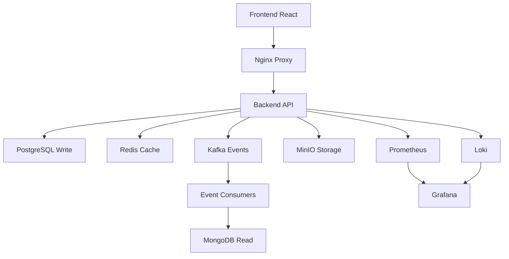

# Personal Finance Hub 💰

> **Uma plataforma completa de gestão financeira pessoal construída com arquitetura event-driven, CQRS e tecnologias modernas.**

Desenvolvido por **Pateta o DEV (John Spearrow)** - Staff Full-Stack Engineer

[](https://opensource.org/licenses/MIT)
[](https://nodejs.org/)
[](https://reactjs.org/)
[](https://www.typescriptlang.org/)

## 🚀 Quick Start

```bash
# 1. Clone o repositório
git clone <your-repo-url>
cd PersonalFinanceHub

# 2. Torne os scripts executáveis
chmod +x scripts/*.sh

# 3. Configure a infraestrutura completa
./scripts/setup-dev.sh

# 4. Execute as migrações do banco
./scripts/migrate.sh

# 5. Popule com dados de demonstração
./scripts/seed-data.sh

# 6. Valide a instalação
./scripts/validate-setup.sh

# 7. Inicie o desenvolvimento
npm run dev
```

**Pronto! 🎉** Acesse http://localhost:3000 e faça login com:
- 📧 **Email**: demo@personalfinance.com
- 🔑 **Password**: password123

---

## 🏗️ Arquitetura Técnica

### Stack Tecnológico

**Backend (Node.js + TypeScript)**
- **Framework**: Express.js com middlewares robustos
- **Banco Write**: PostgreSQL 16 com replica para reads
- **Banco Read**: MongoDB 7.0 com replica set
- **Cache**: Redis 7.2 em cluster (master/replica)
- **Messaging**: Apache Kafka 3-node cluster
- **Storage**: MinIO (S3-compatible)
- **Patterns**: CQRS, Event Sourcing, Outbox Pattern

**Frontend (React + Next.js)**
- **Framework**: Next.js 14 com App Router
- **UI**: Tailwind CSS + shadcn/ui components
- **State**: Zustand + React Query
- **Charts**: Recharts para visualizações
- **Forms**: React Hook Form + Zod validation

**DevOps & Observabilidade**
- **Containers**: Docker + Docker Compose
- **Monitoring**: Prometheus + Grafana + Loki
- **Tracing**: Jaeger distributed tracing
- **Reverse Proxy**: Nginx com rate limiting
- **CI/CD**: GitHub Actions workflows

### Padrões Arquiteturais



**🔄 CQRS Pattern**
- **Write Side**: PostgreSQL com transações ACID
- **Read Side**: MongoDB com agregações otimizadas
- **Sync**: Kafka events com eventual consistency

**📊 Double-Entry Ledger**
- Contabilidade de dupla entrada para precisão
- Auditoria completa de todas as transações
- Rollups automáticos para dashboards

---

## 📊 Funcionalidades

### ✅ Core Features
- **Dashboard em tempo real** com métricas financeiras
- **Gestão de transações** com categorização automática
- **Planejamento orçamentário** com tracking de metas
- **Múltiplas contas** (bancárias, cartões, investimentos)
- **Transações recorrentes** (salários, assinaturas)
- **Sistema de tags** flexível para organização
- **Relatórios e exportações** (PDF/CSV/Excel)

### 🔐 Segurança & Compliance
- **Autenticação JWT** com refresh token rotation
- **Rate limiting** inteligente por endpoint
- **Idempotency keys** para operações críticas
- **Audit log** completo de todas as mudanças
- **Encryption at rest** para dados sensíveis
- **RBAC** com permissões granulares

### 📈 Performance & Scaling
- **Cache em camadas** (L1: Memory, L2: Redis, L3: MongoDB)
- **Connection pooling** otimizado
- **Database sharding** preparado
- **CDN ready** para assets estáticos
- **Horizontal scaling** com Kubernetes

---

## 🛠️ Desenvolvimento

### Pré-requisitos
- **Node.js** 18+ (recomendado 20+)
- **Docker** & Docker Compose
- **PostgreSQL** client tools (psql)
- **Git** 2.0+

### Estrutura do Projeto

```
PersonalFinanceHub/
├── 📁 backend/               # API Node.js + TypeScript
│   ├── 📁 src/
│   │   ├── 📁 api/          # Controllers, routes, middlewares
│   │   ├── 📁 core/         # Business logic, use cases
│   │   ├── 📁 infrastructure/ # Database, messaging, external
│   │   ├── 📁 jobs/         # Background tasks
│   │   └── 📁 shared/       # Utilities, types, constants
│   └── 📁 tests/            # Unit, integration, e2e tests
├── 📁 frontend/             # React + Next.js app
│   ├── 📁 src/
│   │   ├── 📁 app/          # Next.js App Router
│   │   ├── 📁 components/   # UI components
│   │   ├── 📁 hooks/        # Custom React hooks
│   │   └── 📁 lib/          # Utils, stores, API clients
│   └── 📁 tests/            # Frontend tests
├── 📁 infrastructure/       # IaC, Docker configs
├── 📁 scripts/              # Automation scripts
└── 📁 docs/                 # Project documentation
```

### Scripts de Desenvolvimento

| Script | Descrição |
|--------|-----------|
| `./scripts/setup-dev.sh` | **Setup inicial completo** - infraestrutura, configs |
| `./scripts/migrate.sh` | **Migrações de banco** - schemas e índices |
| `./scripts/seed-data.sh` | **Dados de demonstração** - usuários e transações |
| `./scripts/validate-setup.sh` | **Validação do sistema** - health checks |
| `./scripts/backup.sh` | **Backup completo** - dados e configurações |
| `npm run dev` | **Desenvolvimento** - backend + frontend |
| `npm run build` | **Build produção** - otimizado |
| `npm run test` | **Testes** - unit + integration + e2e |

### Comandos Úteis

```bash
# Monitorar logs em tempo real
docker-compose logs -f backend frontend

# Restart específico de serviços
docker-compose restart postgres-master mongodb redis-master

# Limpar dados e reiniciar
docker-compose down -v && ./scripts/setup-dev.sh

# Backup dos dados
./scripts/backup.sh

# Restore de backup
./scripts/backup.sh restore backup_file.tar.gz

# Health check do sistema
./scripts/validate-setup.sh quick
```

---

## 🌐 URLs dos Serviços

### Aplicação
- **Frontend**: http://localhost:3000
- **Backend API**: http://localhost:3333
- **API Docs**: http://localhost:3333/docs

### Ferramentas de Desenvolvimento
- **Kafka UI**: http://localhost:8080
- **Grafana**: http://localhost:3001 (`admin` / `grafana_secure_2024`)
- **Prometheus**: http://localhost:9090
- **MinIO Console**: http://localhost:9001 (`pfh_admin` / `minio_secure_2024`)
- **Jaeger**: http://localhost:16686

### Databases (para clientes externos)
- **PostgreSQL Master**: localhost:5432
- **PostgreSQL Replica**: localhost:5433
- **MongoDB Primary**: localhost:27017
- **Redis Master**: localhost:6379

---

## 📋 Esquema de Dados

### PostgreSQL (Write Side)
```sql
-- Core entities
users, accounts, categories, merchants, tags

-- Transações e ledger
transactions, ledger_entries, chart_of_accounts

-- Orçamentos e recorrência  
budgets, budget_categories, recurring_transactions

-- Events e auditoria
outbox_events, event_store, audit_log

-- Notificações e sistema
notification_queue, system_events, idempotency_keys
```

### MongoDB (Read Side)
```javascript
// Agregações otimizadas para leitura
daily_category_spend: { user_id, date, category, amount, count }
monthly_summaries: { user_id, period, totals, categories, variance }
dashboard_cache: { user_id, period, computed_data, expires_at }

// Índices de performance
user_id_1_date_1_category_1 (unique)
user_id_1_period_1 (unique)
expires_at_1 (TTL index)
```

### Redis (Cache Layer)
```bash
# Dashboard cache (5min TTL)
dash:{user_id}:{period} -> JSON

# Session storage (7d TTL)
session:{token} -> user_data

# Idempotency keys (24h TTL)
idempotency:{key} -> response_data

# Rate limiting (1min TTL)
rate_limit:{ip}:{endpoint} -> count
```

---

## 📊 Monitoramento

### Dashboards Grafana

**📈 Business Metrics**
- Transações por dia/semana/mês
- Usuários ativos e retenção
- Top categorias de gastos
- Orçamentos vs realizado

**⚡ Performance Metrics**
- Response time por endpoint
- Database query performance
- Cache hit rates
- Kafka consumer lag

**🔧 System Health**
- CPU, Memory, Disk usage
- Database connections
- Error rates e alertas
- Uptime e SLA

### Alertas Configurados
- 🚨 **Critical**: API response time > 2s
- ⚠️ **Warning**: Cache hit rate < 80%
- 📊 **Info**: Backup job completion
- 💾 **Storage**: Disk usage > 85%

---

## 🔐 Segurança

### Autenticação & Autorização
```typescript
// JWT com rotation automática
{
  accessToken: { exp: '15min', alg: 'RS256' },
  refreshToken: { exp: '7days', httpOnly: true, rotation: true }
}

// RBAC granular
permissions: {
  'budget:read:own': ['user'],
  'budget:write:own': ['user'],  
  'reports:export': ['user', 'premium'],
  'admin:users:*': ['admin']
}
```

### Rate Limiting
```nginx
# Limites por endpoint
/api/auth/*     -> 5 req/15min
/api/transactions -> 100 req/min  
/api/reports/export -> 3 req/hour
```

### Dados Sensíveis
- **PII Encryption**: AES-256-GCM
- **Password Hashing**: bcrypt rounds=12
- **Database**: TLS + field-level encryption
- **Logs**: PII masking automático

---

## 📚 API Documentation

### Endpoints Principais

**🔐 Authentication**
```http
POST /api/auth/register     # Criar conta
POST /api/auth/login        # Login
POST /api/auth/refresh      # Renovar token  
POST /api/auth/logout       # Logout
```

**💰 Transactions**
```http
GET    /api/transactions              # Listar transações
POST   /api/transactions              # Criar transação
PUT    /api/transactions/:id          # Atualizar transação
DELETE /api/transactions/:id          # Deletar transação
POST   /api/transactions/import       # Importar CSV
```

**📊 Dashboard**
```http
GET /api/dashboard?period=2024-01     # Dashboard do mês
GET /api/dashboard/summary            # Resumo geral
GET /api/dashboard/categories         # Gastos por categoria
GET /api/dashboard/trends             # Tendências temporais
```

**📈 Budgets**
```http
GET  /api/budgets/:period            # Orçamento do período
POST /api/budgets                    # Criar orçamento  
PUT  /api/budgets/:id                # Atualizar orçamento
```

**📑 Reports**
```http
GET  /api/reports/transactions       # Relatório de transações
POST /api/reports/export/csv         # Exportar CSV
POST /api/reports/export/pdf         # Exportar PDF (async)
GET  /api/reports/jobs/:jobId        # Status do job
```

### Response Format
```typescript
// Success response
{
  success: true,
  data: T,
  meta?: {
    pagination?: { page, limit, total, pages },
    filters?: object
  }
}

// Error response  
{
  success: false,
  error: {
    code: string,
    message: string,  
    details?: object
  },
  correlationId: string
}
```

---

## 🧪 Testes

### Estratégia de Testes
- **Unit Tests**: 80%+ coverage em business logic
- **Integration Tests**: Database, APIs, messaging
- **E2E Tests**: User journeys críticos
- **Performance Tests**: Load testing com k6
- **Contract Tests**: API schema validation

### Executando Testes
```bash
# Backend tests
cd backend
npm run test              # Unit tests
npm run test:integration  # Integration tests  
npm run test:e2e         # End-to-end tests
npm run test:coverage    # Coverage report

# Frontend tests
cd frontend  
npm run test             # Unit tests (Jest)
npm run test:e2e         # E2E tests (Playwright)
npm run test:visual      # Visual regression

# Performance tests
npm run test:load        # Load testing
```

---

## 🚀 Deploy

### Ambientes

**🔧 Development**
- Docker Compose local
- Hot reload habilitado
- Debug ports expostos
- Dados de seed inclusos

**🧪 Staging**
- Kubernetes cluster
- Dados sanitizados
- Performance testing
- Smoke tests automáticos

**🏭 Production**
- Auto-scaling habilitado
- Multi-zone deployment
- Backup automático
- Monitoring 24/7

### Infrastructure as Code

```bash
# Terraform (AWS/GCP/Azure)
cd infrastructure/terraform
terraform init
terraform plan -var-file="environments/prod.tfvars"
terraform apply

# Kubernetes deployment
kubectl apply -k infrastructure/kubernetes/overlays/prod

# Monitoring stack
helm install monitoring prometheus-community/kube-prometheus-stack
```

---

## 🤝 Contribuindo

### Workflow
1. **Fork** o repositório
2. **Clone** seu fork localmente
3. **Branch** feature/bugfix: `git checkout -b feature/nova-funcionalidade`
4. **Develop** seguindo os padrões do projeto
5. **Test** sua implementação
6. **Commit** com conventional commits
7. **Push** e abra um **Pull Request**

### Padrões de Código
- **TypeScript** strict mode
- **ESLint** + **Prettier** enforcement
- **Conventional Commits** para mensagens
- **Husky** hooks para validação pre-commit
- **100% type safety** end-to-end

### Code Review Checklist
- [ ] ✅ Testes passando (unit + integration)
- [ ] 📊 Performance não degradou
- [ ] 🔒 Segurança validada
- [ ] 📚 Documentação atualizada
- [ ] 🎨 UI/UX consistente
- [ ] ♿ Acessibilidade considerada

---

## 📖 Documentação Adicional

- [**🏗️ Architecture Deep Dive**](./docs/ARCHITECTURE.md) - Decisões arquiteturais e ADRs
- [**🚀 Deployment Guide**](./docs/DEPLOYMENT.md) - Deploy em diferentes ambientes
- [**🔌 API Reference**](./docs/API.md) - Documentação completa da API
- [**🤝 Contributing Guide**](./docs/CONTRIBUTING.md) - Como contribuir com o projeto
- [**📊 Database Schema**](./docs/DATABASE.md) - Esquemas e relacionamentos
- [**🔧 Development Setup**](./docs/DEVELOPMENT.md) - Setup detalhado para dev

---

## 🐛 Troubleshooting

### Problemas Comuns

**🔥 Serviços não sobem**
```bash
# Verificar status dos containers
docker-compose ps

# Ver logs detalhados  
docker-compose logs backend frontend

# Reiniciar serviços problemáticos
docker-compose restart postgres-master mongodb
```

**💾 Erro de conexão com banco**
```bash
# Aguardar inicialização completa
./scripts/validate-setup.sh database

# Verificar credenciais no .env
cat .env | grep -E "(POSTGRES|MONGO|REDIS)"

# Rebuild dos containers se necessário
docker-compose down -v
docker-compose up -d --build
```

**⚡ Performance lenta**
```bash
# Verificar uso de recursos
docker stats

# Limpar cache e rebuild
docker system prune -f
./scripts/setup-dev.sh
```

**🔄 Kafka/Events não funcionam**
```bash
# Verificar tópicos do Kafka
docker exec pfh-kafka-1 kafka-topics --list --bootstrap-server localhost:9092

# Recriar tópicos se necessário
./scripts/create-kafka-topics.sh

# Verificar consumers
docker-compose logs kafka-1 kafka-2 kafka-3
```

### Support & Community
- 🐛 **Bug Reports**: Abra uma issue no GitHub
- 💡 **Feature Requests**: Use o template de feature request
- 💬 **Discussões**: GitHub Discussions
- 📧 **Suporte**: john.spearrow@personalfinance.com

---

## 📝 License

Este projeto está licenciado sob a **MIT License** - veja o arquivo [LICENSE](LICENSE) para detalhes.

---

## 🙏 Agradecimentos

**Tecnologias & Libraries**
- Node.js, React, PostgreSQL, MongoDB communities
- shadcn/ui, Tailwind CSS, Recharts teams
- Kafka, Redis, MinIO maintainers
- Prometheus, Grafana, Jaeger projects

**Inspirações**
- Domain-Driven Design (Eric Evans)
- Clean Architecture (Robert Martin)
- Event Sourcing patterns (Greg Young)
- CQRS architectural style

---

<div align="center">

**🚀 Built with ❤️ by Pateta o DEV (John Spearrow)**

*Staff Full-Stack Engineer · Event-Driven Architecture Specialist*

[](https://linkedin.com/in/johnspearrow)
[](https://github.com/johnspearrow)
[](https://twitter.com/johnspearrow)

---

⭐ **Star este projeto** se ele foi útil para você!

</div>